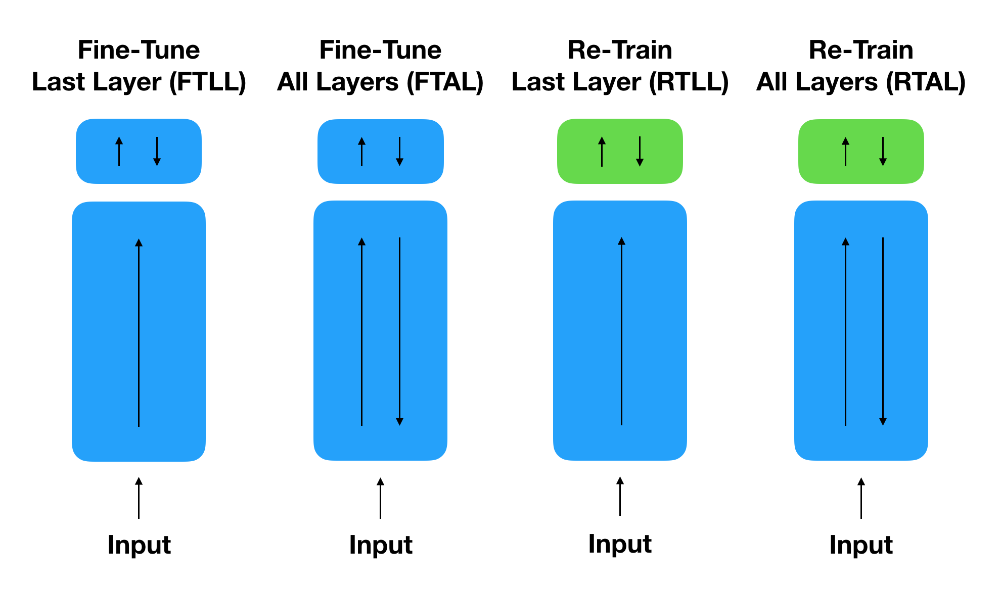

# Watermarking Deep Neural Networks

This repository provides a PyTorch implementation of the paper [Turning Your Weakness Into a Strength: Watermarking Deep Neural Networks by Backdooring](https://www.usenix.org/system/files/conference/usenixsecurity18/sec18-adi.pdf). This repository provides scripts for watermarking neural networks by backdooring as well as fine-tuning them. A blog post with a non-formal description of the proposed method can be found [here](https://medium.com/@carstenbaum/the-ubiquity-of-machine-learning-and-its-challenges-to-intellectual-property-dc38e7d66b05).

## Paper 

[Turning Your Weakness Into a Strength: Watermarking Deep Neural Networks by Backdooring](https://www.usenix.org/system/files/conference/usenixsecurity18/sec18-adi.pdf)
</br>
[Yossi Adi](https://adiyoss.github.io/)<sup>1</sup>, [Carsten Baum](http://www.carstenbaum.com/)<sup>1</sup>, [Moustapha Cisse](http://moustaphacisse.com/)<sup>2</sup>, [Benny Pinkas](http://www.pinkas.net/)<sup>1</sup>, [Joseph Keshet](http://u.cs.biu.ac.il/~jkeshet/)<sup>1</sup>
</br>
<sup>1 </sup>Bar-Ilan University, <sup>2 </sup>Google, Inc
</br>
27th USENIX Security Symposium, [USENIX](https://www.usenix.org/conference/usenixsecurity18).</br>

## Content
The repository contains three main scripts: `train.py, predict.py, and fine-tune.py` where you can train (with and without watermark), predict and fine-tune models. 

Additionally, this repo contains the trigger set images used to embed the watermarks.

At the moment the code supports training and evaluating on [CIFAR-10](https://www.cs.toronto.edu/~kriz/cifar.html) dataset **only**. More datasets will be supported soon. 

## Dependencies
[Python 3.6](https://www.anaconda.com/download)

[PyTorch 0.4.1](https://pytorch.org/)

## Usage

### 1. Cloning the repository
```bash
$ git clone https://github.com/adiyoss/WatermarkNN.git
$ cd WatermarkNN
```
### 2. Training

The `train.py` script allows you to train a model with or without a trigger set. 

For example: 
```
python train.py --batch_size 100 --max_epochs 60 --runname train --wm_batch_size 2 --wmtrain
```
For training without the trigger set, omit the `--wmtrain` flag.
</br>
In case you want to resume training you can use the `--resume` flag. Lastly, all log files and models will have the prefix `--runname`.


#### New Trigger Set
For training with your own trigger set and labels, provide the path to the data using the `--wm_path` flag and the path to the trigger set using the `--wm_lbl` flag.

### 3. Testing

The `predict.py` script allows you to test your model on CIFAR10 test set or on a provided trigger set. </br>
To test a trained model on CIFAR10 dataset (without the trigger set) run the following command: 
```
python predict.py --model_path checkpoint/model.t7
```
To test a trained model on a specified trigger set, run the following command: 
```
python predict.py --model_path checkpoint/model.t7 --wm_path ./data/trigger_set --wm_lbl labels-cifar.txt --testwm
```

### 4. Fine-Tuning

We define four ways to fine-tune: Fine-Tune Last Layer (FTLL), Fine-Tune All Layers (FTAL), Retrain Last Layer (RTLL), and Retrain All Layers (RTAL). A graphic description of the aforementioned methods described below: 
</br>

Below we provide example scripts for all four fine-tuning techniques.

#### Fine-Tune Last Layer (FTLL)
```
python fine-tune.py --lr 0.01 --load_path checkpoint/model.t7 --save_dir checkpoint/ --save_model ftll.t7 --runname fine.tune.last.layer
```

#### Fine-Tune All Layers (FTAL)
```
python fine-tune.py --lr 0.01 --load_path checkpoint/model.t7 --save_dir checkpoint/ --save_model ftal.t7 --runname fine.tune.all.layers --tunealllayers
```

#### Retrain Last Layer (RTLL)
```
python fine-tune.py --lr 0.01 --load_path checkpoint/model.t7 --save_dir checkpoint/ --save_model rtll.t7 --runname reinit.last.layer --reinitll
```

#### Retrain All Layers (RTAL)
```
python fine-tune.py --lr 0.01 --load_path checkpoint/model.t7 --save_dir checkpoint/ --save_model rtal.t7 --runname reinit_all.layers --reinitll --tunealllayers
```

For more training / testing / fine-tuning options, look inside the scripts arguments.

## Citation 
If you find our work useful please cite: 
```
@inproceedings {217591,
author = {Yossi Adi and Carsten Baum and Moustapha Cisse and Benny Pinkas and Joseph Keshet},
title = {Turning Your Weakness Into a Strength: Watermarking Deep Neural Networks by Backdooring},
booktitle = {27th {USENIX} Security Symposium ({USENIX} Security 18)},
year = {2018},
isbn = {978-1-931971-46-1},
address = {Baltimore, MD},
pages = {1615--1631},
url = {https://www.usenix.org/conference/usenixsecurity18/presentation/adi},
publisher = {{USENIX} Association},
}
```

## Acknowledgement
This work was supported by the BIU Center for Research in Applied Cryptography and Cyber Security in conjunction with the Israel National Cyber Directorate in the Prime Minister’s Office.


